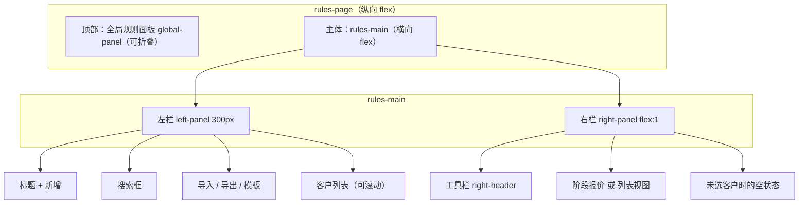

# Rules management page
_Exported on 2026/7/5 at GMT+8 1:21:53 from Cursor (3.4.20)_

---

**User**

找出规则管理的页面

---

**Cursor**

正在搜索代码库中与“规则管理”相关的页面。


**规则管理**页面位置如下：

## 前端页面

**主文件：** `frontend/src/views/Rules.vue`  
这是规则管理的核心页面（约 1500+ 行），包含：

- **全局规则设置**（可折叠）：保底规则、加价规则、省份加价
- **左侧客户列表**：客户增删、规则复制/导入
- **右侧规则编辑**：客户规则的增删改查

## 路由与导航

| 项目 | 位置 |
|------|------|
| **路由** | `/rules`（Hash 模式下为 `/#/rules`） |
| **路由配置** | `frontend/src/router/index.ts` 第 44 行 |
| **侧边栏入口** | `frontend/src/views/Layout.vue` 第 24–27 行 |

```44:44:frontend/src/router/index.ts
        { path: 'rules', name: 'Rules', component: () => import('@/views/Rules.vue'), meta: { title: '规则管理' } },
```

```24:27:frontend/src/views/Layout.vue
        <el-menu-item index="/rules">
          <el-icon><Setting /></el-icon>
          <span>规则管理</span>
        </el-menu-item>
```

## 后端逻辑

规则相关的 API 在 `internal/app/app.go`（约第 153 行起），包括：

- `GetGlobalRules` / `SaveGlobalRules` — 全局规则
- `GetRules` / `GetRulesByCustomer` — 查询规则
- `SaveRule` / `DeleteRule` / `DeleteRulesBatch` — 规则 CRUD
- `GetCustomers` / `CopyCustomerRules` / `ImportCustomerRules` — 客户与批量操作

数据层在 `internal/rules/` 目录（`repository.go`、`models.go`、`global.go` 等）。

## 相关页面

- **`frontend/src/views/TestRule.vue`** — 规则测试（路由 `/test-rule`），不是规则管理本身，但和规则相关。

启动应用后，在侧边栏点击「规则管理」，或直接访问 `/#/rules` 即可进入该页面。

---

**User**

规则管理的页面布局是怎么样的，

---

**Cursor**

正在阅读 `Rules.vue` 的模板与样式，梳理页面布局结构。


规则管理页面（`Rules.vue`）整体是**上下结构 + 左右分栏**，最大宽度 1400px，纵向 flex 排列。

## 整体结构



---

## 1. 顶部：全局规则面板（可折叠）

点击标题栏可展开/收起（`globalCollapsed`）。

展开后分三行 + 底部保存按钮：

| 区块 | 内容 |
|------|------|
| **保底规则** | 默认首重、首重单价、续重单价、保底价、无重量默认价 |
| **加价规则** | 固定加价（元/单）、百分比加价（%） |
| **省份加价** | 已有省份标签列表 + 省份选择 + 金额 +「添加」 |
| **操作** | 右对齐「保存全局设置」 |

样式：白底圆角卡片，标题栏浅蓝渐变背景。

---

## 2. 主体：左右分栏（`rules-main`）

最小高度 500px，左右间距 12px。

### 左栏 — 客户列表（固定约 300px）

从上到下：

1. **标题栏**：「客户列表」+「新增」按钮  
2. **搜索框**：过滤客户  
3. **操作行**：导入 / 导出 / 模板（三个按钮等宽）  
4. **客户列表**（`flex:1`，纵向滚动）  
   - 每项：头像图标 + 客户名 + 规则条数标签 + 删除  
   - 支持点击选中、拖拽（复制规则到其他客户）  
   - 选中项高亮（紫色渐变边框）

### 右栏 — 规则编辑区（占满剩余宽度）

两种状态：

**未选客户时**  
居中空状态：图标 +「选择左侧客户查看其计费规则」+ 副提示。

**已选客户时**  
顶部工具栏 + 下方内容区：

**工具栏（`right-header`）**
- 左侧：客户名、规则数量、视图切换（**阶段报价** / **列表视图**）
- 右侧：区域模板生成、批量删除、新增规则

**内容区（二选一）**

| 视图 | 说明 |
|------|------|
| **阶段报价**（默认 `viewMode='zone'`） | 宽表格：省份、区域、定价模式、各重量段价格、首续重、保底费、续重单位、拉均重/偏差加价、启用开关、操作 |
| **列表视图** | 传统表格：多选、省份、区域、定价/续重模式、首续重单价、区间价格、保底/最高/附加费、规则类型、启用、备注、操作 |

表格高度自适应视口（约 `calc(100vh - 420~460px)`），内容可横向/纵向滚动。

---

## 3. 弹窗层（覆盖在主布局之上）

不在主布局内，以对话框形式出现：

| 弹窗 | 宽度 | 用途 |
|------|------|------|
| 新增客户 | 400px | 输入客户名称 |
| 新增/编辑规则 | 700px | 规则类型、省份、定价模式、续重模式、价格等表单 |
| 区域模板生成 | 900px | 6 区体系批量生成规则，含各重量段价格表 |
| 拉均重/偏差加价配置 | 600px | 基准重量、步长、加价等 |

---

## 布局要点（CSS）

```1317:1347:frontend/src/views/Rules.vue
.rules-page { display: flex; flex-direction: column; gap: 12px; max-width: 1400px; }
// ...
.rules-main { display: flex; gap: 12px; flex: 1; min-height: 500px; }
```

- **左栏**：`width: 300px`，纵向 flex，列表区域滚动  
- **右栏**：`flex: 1; min-width: 0`，避免表格撑破布局  
- **视觉**：白底卡片 + 圆角 10px + 浅阴影，标题栏统一浅蓝渐变

---

## 交互流程简述

1. 顶部可配置全局保底/加价/省份加价  
2. 左侧选客户（或新增/导入）  
3. 右侧查看/编辑该客户规则（阶段报价或列表视图）  
4. 复杂编辑通过弹窗完成（单条规则、区域模板、拉均重）

如果你需要，我可以再按「阶段报价表格每一列的含义」或「拖拽复制规则的交互」单独展开说明。

---

**User**

右栏高度放大，能看到全部34个省份，把 基准 0.3kg 步长 0.1kg/+¥0.1 配置 全局 放一行

---

**Cursor**

查看右栏表格与拉均重单元格的当前实现。


调整右栏高度布局，并将拉均重信息合并为单行显示。


默认折叠全局规则面板并压缩表格行高，以便在一屏内显示更多省份。


撤销默认折叠全局面板的改动，保持改动范围最小。


已调整 `Rules.vue`，主要改动如下：

## 1. 右栏高度放大

- 页面占满可视区域：`height: calc(100vh - 128px)`（扣除顶栏、内边距、页脚）
- 主体区域改为 flex 自适应：`rules-main`、`zone-view-wrap` 使用 `flex: 1; min-height: 0`
- 去掉表格 `max-height` 限制，以及 `zone-view-wrap` 原来的 `max-height: calc(100vh - 420px)`
- 压缩阶段报价表格行高：`padding: 4px 0`

右栏会尽量占满剩余高度，34 个省份行高也更紧凑。若顶部「全局规则设置」展开，仍可能需少量滚动；可点击折叠以腾出更多空间。

## 2. 拉均重信息单行显示

原来分三行（基准+开关 / 步长 / 配置+全局），现合并为一行：

**基准 0.3kg · 步长 0.1kg/+¥0.1 · 配置 · 全局 · 开关**

列宽由 240px 调整为 300px，避免单行内容被挤换行。

---

刷新规则管理页即可查看效果。若希望默认折叠「全局规则设置」以在一屏内显示全部 34 省，可以说一声，我可以加上。

---

**User**

对，我希望阶段报价和列表视图在一屏内显示全部34省

---

**Cursor**

继续优化布局，使阶段报价和列表视图都能在一屏内显示全部 34 省。


将拉均重移出表格列、默认折叠全局规则，并压缩两种视图的表格行高，使 34 省能在一屏内显示。


已按「一屏显示 34 省」做了进一步优化，主要改动如下：

## 布局优化

1. **默认折叠「全局规则设置」**  
   进入页面时自动收起，把垂直空间留给表格。

2. **拉均重移到右栏工具栏**  
   不再占表格每一行，改为在客户名/视图切换旁单行显示：  
   `基准 0.3kg · 步长 0.1kg/+¥0.1 · 配置 · 全局 · 开关`  
   表格行高明显降低。

3. **紧凑表格样式**（阶段报价 + 列表视图共用 `rules-compact-table`）  
   - 行高 22px  
   - 更小内边距、标签、开关  
   - 去掉列表视图的 `max-height` 限制

4. **页面高度占满**  
   `height: calc(100vh - 142px)`，并略微压缩顶栏、工具栏间距。

5. **表格区域不纵向滚动**  
   `overflow-y: hidden`，34 行完整展示；列多时可横向滚动。

## 预期效果

在 1080p 屏幕下（全局规则折叠）：
- **阶段报价**：34 省约 770px 表格高度，可一屏看完  
- **列表视图**：同样紧凑行高，34 省纵向一屏展示  

若展开「全局规则设置」，或屏幕高度低于 900px，可能仍需少量纵向滚动。刷新页面即可查看效果。

---

**User**

打包exe我试一下

---

**Cursor**

查找项目的打包方式与构建脚本。


正在执行项目自带的打包脚本。


打包已完成。

## 输出文件

**路径：** `c:\Users\ccc\Desktop\yunfei\mmjs2-main\yunfei.exe`  
**大小：** 约 14.0 MB（14,697,984 字节）

## 构建过程

1. 安装了前端依赖（`npm install`）
2. 编译前端（Vite → `frontend/dist`）
3. Go 编译生成 `yunfei.exe`（含你刚改的规则管理页面布局）

## 如何试用

双击运行，或在终端执行：

```powershell
c:\Users\ccc\Desktop\yunfei\mmjs2-main\yunfei.exe
```

程序会启动本地 HTTP 服务并打开浏览器。进入 **规则管理** 页，检查阶段报价 / 列表视图是否一屏显示 34 省。

## 下次重新打包

在项目根目录执行：

```powershell
.\build.ps1
```

或双击 `build.bat`。

如果启动后端口被占用或页面打不开，告诉我具体现象，我帮你排查。

---

**User**

区域模板生成参考价  这个参考价是参照哪个表

---

**Cursor**

查找“区域模板生成”中“加载参考价”的数据来源。


「加载参考价」**不是从数据库某张表读的**，而是后端代码里写死的一套**示例价格表**。

## 数据来源

| 项目 | 说明 |
|------|------|
| **代码位置** | `internal/rules/zones.go` 中的 `GetSamplePriceTable()` |
| **API** | `GET /api/zones/sample-price` |
| **前端调用** | `store.fetchSamplePriceTable()` → `loadSamplePrice()` / 打开弹窗时 `buildZonePriceList()` |

注释里写的是：**「基于图片中的报价」**，即开发时按某张报价图录入的固定数值，不是运行时从 Excel、规则表或 SQLite 查出来的。

```297:309:internal/rules/zones.go
// GetSamplePriceTable 获取示例价格表（基于图片中的报价）
func GetSamplePriceTable() map[string]ZonePriceScheme {
	return map[string]ZonePriceScheme{
		"一区": {
			Price0_05: 2.26,
			Price05_1: 2.46,
			Price1_2:  3.56,
			Price2_3:  4.76,
			First3_30: 3.76,
			Cont3_30:  0.8,
			First30up: 3.86,
			Cont30up:  0.8,
		},
```

六区各自有一套价格（0~0.5kg、0.5~1kg、1~2kg、2~3kg、3~30kg 首续重、30kg+ 首续重），一直到「六区」（港澳台）。

## 和哪些「表」有关、哪些无关

**参考价本身：**
- ❌ 不是 `freight_rules`（客户规则表）
- ❌ 不是 `freight_zones`（区域表）
- ❌ 不是任何 SQLite 表
- ✅ 就是 Go 源码里的 `map[string]ZonePriceScheme`

**区域模板（弹窗里「一区～六区」及包含省份）：**
- 来自 `GetDefaultZoneTemplates()`，同样是代码写死的 6 区划分
- 实际**生成规则**时用的是数据库里的 `freight_zones`（`GenerateZoneRules` → `GetAllZones()`）

**价格字段结构**（`ZonePriceScheme`）：

- `price_0_05` / `price_05_1` / `price_1_2` / `price_2_3`
- `first_3_30` / `cont_3_30`
- `first_30up` / `cont_30up`

## 流程简述

1. 点「区域模板生成」→ 拉 6 区模板 + 参考价（默认就填参考价）
2. 点「加载参考价」→ 再次从 `/api/zones/sample-price` 取同一套硬编码价格覆盖表单

若要改成「参照某客户现有规则」或「从 Excel/配置表读取」，需要改 `GetSamplePriceTable()` 或新增数据源；当前没有这类逻辑。需要的话我可以帮你设计改法。

---

**User**

加一个按钮，从EXCEL导入参考价

---

**Cursor**

先查看现有的 Excel 导入实现和区域模板弹窗结构，再添加“从 Excel 导入参考价”功能。


正在实现后端 Excel 解析、API 接口和前端导入按钮。


已加上「从 Excel 导入参考价」功能，区域模板生成弹窗里现在有三个按钮：

| 按钮 | 作用 |
|------|------|
| **下载模板** | 下载 `区域参考价模板.xlsx`（含内置参考价示例） |
| **从Excel导入参考价** | 选择 `.xlsx/.xls` 文件，解析后填入下方价格表 |
| **加载内置参考价** | 恢复代码里写死的默认参考价 |

## Excel 模板格式

第一行表头（9 列）：

| 区域 | 0~0.5kg | 0.5~1kg | 1~2kg | 2~3kg | 3~30kg首重 | 3~30kg续重 | 30kg+首重 | 30kg+续重 |
|------|---------|---------|-------|-------|------------|------------|-----------|-----------|
| 一区 | 2.26 | … | … | … | … | … | … | … |
| 二区 | … | | | | | | | |
| … | | | | | | | | |
| 六区 | | | | | | | | |

- **区域列**须与系统一致：`一区`～`六区`
- 第一行含「区域」会自动当作表头跳过
- 支持带 `¥`、`元` 的数值

## 实现位置

- 后端解析：`internal/rules/zones.go` → `ParsePriceTableFromRows`
- API：`POST /api/zones/import-price`、`GET /api/zones/price-template`
- 前端：`Rules.vue` 区域模板弹窗工具栏

重新打包后即可试用：

```powershell
.\build.ps1
```

---

**User**

打包我测试一下

---

**Cursor**

打包完成。

**文件：** `c:\Users\ccc\Desktop\yunfei\mmjs2-main\yunfei.exe`（约 14.03 MB）

**运行：**
```powershell
c:\Users\ccc\Desktop\yunfei\mmjs2-main\yunfei.exe
```

**建议测试项：**
1. **规则管理** → 选客户 → **区域模板生成**
2. **下载模板** → 编辑 Excel → **从Excel导入参考价**
3. 阶段报价 / 列表视图是否一屏显示 34 省

有问题直接说现象，我帮你看。

---

**User**

打包成喵喵云结算.exe  并添加exe的图标，

---

**Cursor**

查看现有的图标资源和打包配置。


更新构建脚本：输出 `喵喵云结算.exe`，并在打包时生成图标资源。


中文文件名在 Go 编译时出现编码问题，改为先编译为临时英文名再重命名。


PowerShell 脚本中文编码有问题，改用 Unicode 码点生成文件名。


打包完成。

## 输出文件

**路径：** `c:\Users\ccc\Desktop\yunfei\mmjs2-main\喵喵云结算.exe`  
**大小：** 约 14.03 MB  

旧的 `yunfei.exe` 已删除。

## 图标

- 图标源文件：`monkey.ico`
- 打包时自动生成 `rsrc_windows_amd64.syso`（6 个尺寸）
- Go 编译时会嵌入 exe 图标（猴子图标）

## 构建脚本更新

`build.ps1` / `build.bat` 已改为：
1. 从 `monkey.ico` 生成图标资源  
2. 输出 `喵喵云结算.exe`（先编译为 `_build_temp.exe` 再重命名，避免中文路径编码问题）

**运行：**
```powershell
c:\Users\ccc\Desktop\yunfei\mmjs2-main\喵喵云结算.exe
```

在资源管理器中应能看到猴子图标和中文文件名。若图标未显示，可刷新一下文件夹或重新打开资源管理器。

---

**User**

规则管理页面还是看不到所有省份，帮我加个滚动条，用彩虹色滚动条明显点

---

**Cursor**

查看规则管理页表格区域的滚动与样式设置。


启用纵向滚动并添加醒目的彩虹色滚动条样式。


已为规则管理右栏的**阶段报价**和**列表视图**加上可滚动区域，并使用醒目的彩虹色滚动条。

## 改动说明

1. **恢复纵向滚动**  
   去掉之前的 `overflow-y: hidden`，改为 `overflow: auto`，内容超出时可上下/左右滚动查看全部 34 省。

2. **彩虹滚动条**（`.rules-rainbow-scroll`）  
   - 宽度 14px，比默认更明显  
   - 滑块：红→橙→黄→绿→蓝→紫→粉渐变  
   - 轨道：浅紫到浅粉渐变  
   - 悬停时颜色加深  
   - Firefox 使用紫色滑块作为 fallback  

3. **表格高度不再被截断**  
   取消 Element Plus 表格内部的高度限制，由外层容器统一滚动，避免省份行被裁切却看不到滚动条。

刷新页面即可看到效果。若在用 exe，需要重新打包：

```powershell
.\build.ps1
```

---

**User**

启用和操作自动隐藏，

---

**Cursor**

查看规则表格中「启用」和「操作」列的实现，排查自动隐藏的原因。


实现「启用」和「操作」列默认自动隐藏，悬停时展开；并修复 fixed 列与外层滚动冲突导致的消失问题。


---

**User**

？

可以试用CURSOR吗

